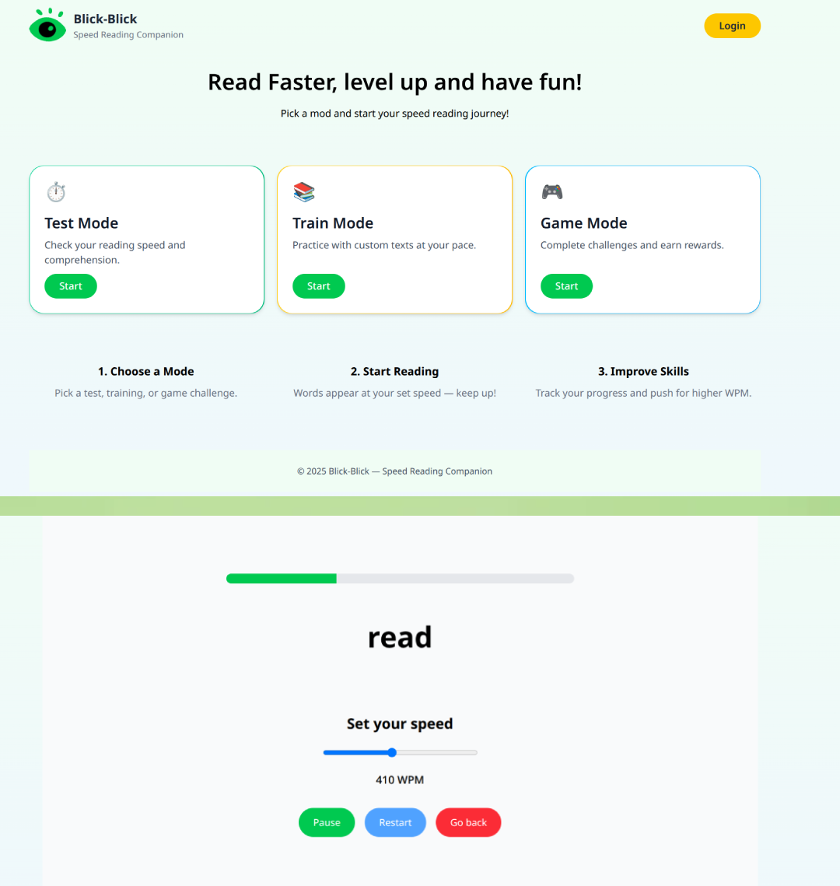

# Blick-Blick : Speed Reading Companion

A gamified speed-reading web app built with **React + Tailwind CSS**.  
Test your reading speed, train with custom texts, and (coming soon) compete in challenges.

 <!-- Optional: add screenshot later -->

---

## Features (MVP)

- **Test Mode** : Measure reading speed with adjustable WPM and progress tracking.
- **Responsive Design** : Looks good on desktop & mobile.
- **Gamified UI** : Inspired by Duolingo's fun and casual style.
- **Coming Soon** : Train Mode & Game Mode.

---

## Tech Stack

**Frontend:**

- React (Vite)
- Tailwind CSS

**Backend (Coming Soon):**

- Node.js + Express
- MongoDB (Mongoose)
- JWT Authentication
- Bcrypt password hashing

**AI Integration (Planned):**

- Generate reading texts dynamically.
- Create QCM (Multiple Choice Questions) automatically for Game Mode.

---

## Roadmap

- **User Accounts** : Sign up/login to save progress.
- **Training Mode** : Upload your own texts & adjust difficulty.
- **Game Mode** : Leaderboards, challenges, rewards.
- **AI Content Generation** : Automatically generate reading texts + QCM for practice and testing.
- **Leaderboard API** : Compare results globally.

---

## 🛠 Installation

1. Clone the repo:

   ```bash
   git clone https://github.com/your-username/blick-blick.git
   cd blick-blick
   ```

2. Install dependencies:

   ```bash
   npm install
   ```

3. Start the dev server:
   ```bash
   npm run dev
   ```
